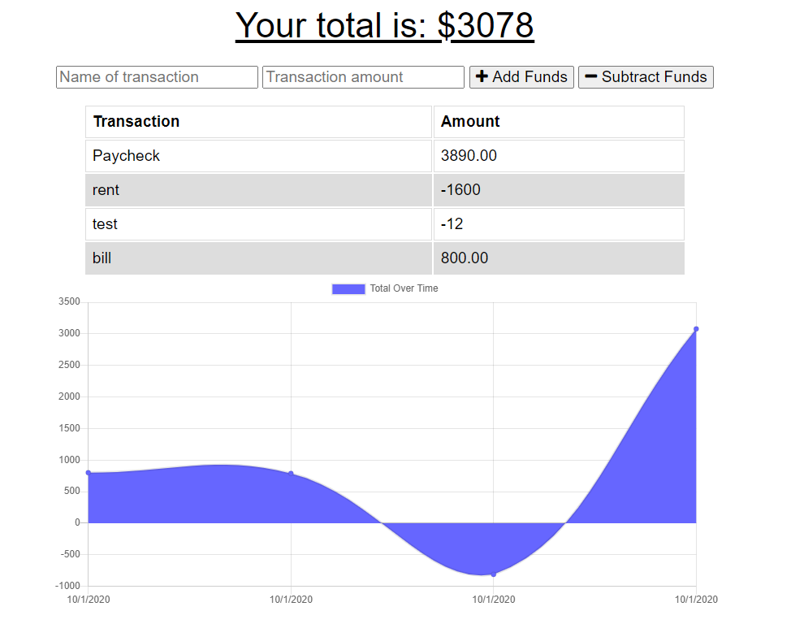

# PWA - Budget Tracker

This App allows you to be able to track my withdrawals and deposits with or without an internet connection to keep my account balance accurate.

The application allows you the following options:
* Budget tracker without an internet connection
* User inputs an expense or deposit
* User will receive a notification that they have added an expense or deposit
* When the user reestablishes an internet connection the deposits or expenses added while they were offline are added to their transaction history and their totals are updated

## Installation
---
1. Clone repo and open Terminal
2. `npm i` for Dependencies
3. In Terminal
   (type) `npm start` to start server

## Usage
---
1. Once you have run the server
2. This app runs on http://localhost:3001/
3. UI allows for you add expenditures and revenue.

    

## Tool & Resources
---
* [Node.js](https://nodejs.org/en/) - JavaScript runtime environment
* [lite-server](https://www.npmjs.com/package/lite-server) - Lightweight development only node server
    ### Dependencies
    ---
    * [Express](https://www.npmjs.com/package/express) - For routing.
    * [Morgan](https://www.npmjs.com/package/morgan) - HTTP request logger middleware for node.js
    * [Mongoose](https://www.npmjs.com/package/mongoose) - Mongoose is a MongoDB object modeling tool designed to work in an asynchronous environment. 
    * [Compression](https://www.npmjs.com/package/compression) - Node.js compression middleware.

* [RepoLink] https://github.com/Ceven8498/Budget-Tracker-PWA
* [Heroku] https://ceven-budget-tracker.herokuapp.com/